# Gourmet Grubbers Documentation

## Overview

The websites main purpose is to act as a space for sharing food recipes. 

Other than the sheer enjoyment of sharing foodie interests, Social capital seems to be the main current form of value being sought by the project owner. This social capital can be used in future if desired to create sales.

The website owner also writes about food in a newsletter, the website can also act partly as a portal to attract people to the Newsletter and also Social Media spaces.

Sign ups involving email address submission mean a mailing list can be progressively built up for future promotion and visibility via email campaigns. 

## Features

Diverse food interests will have a presence on the website including vegan and gluten free types.

The branding and theme of the website is to present food types in line with the website title 'Gourmet Grubbers', that is, grub (ie everyday sorts of food) that has a gourmet twist (exotic enhancements mainly via variations/additions of ingredients used).

The website aims to deliver some recipes in a novel form, using carousels, to make the format for interaction more interesting than the expected 'recipe book' type of format. It is proposed that this might act as 'bait' to lure viewers and incite their curiosity to find out more aswell, while inflaming their desire for the food types presented.

## UX/UI
Wireframes were created with a few different design possibilities in mind. So, you will find a few extra pages here or currently unused designs, included here for reference back to in future iterations. Wireframing was done in line with most essential User Stories. Considerations were to be eye catching, simple, novel and easy to find recipes. Must haves were in line with the core brief of providing recipes from the site owner to the public. Additional features and considerations, of lower priority, were surrounding increasing Newsletter signups, social media following and brand identity formation.

### Wireframes 

**Home/Landing page**

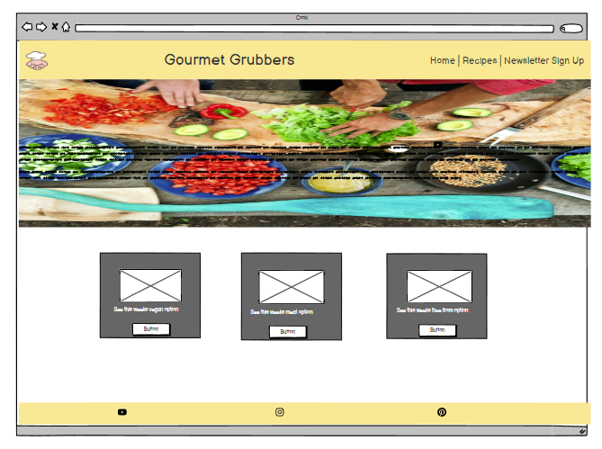

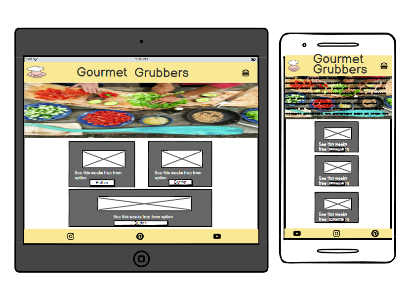

**Recipe Layout in use**

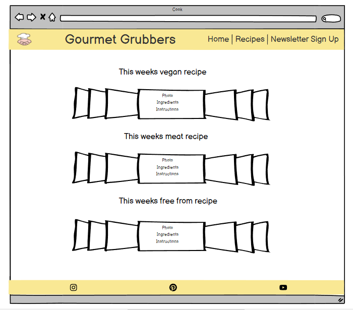

**Alternative recipe layouts**

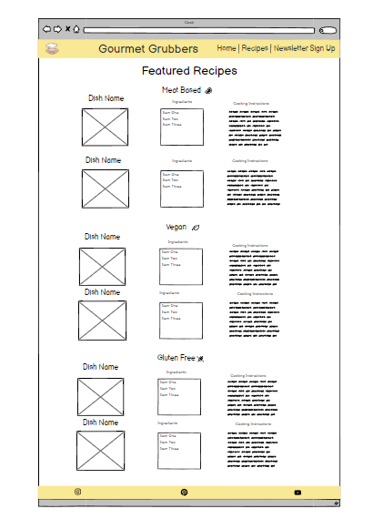

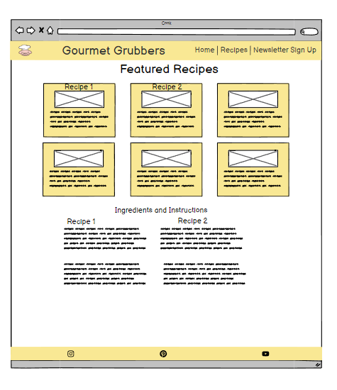

**News**

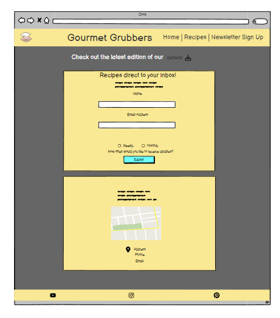

## User stories and their solutions**

### End-User Stories**

 - As a User I want a clear home page so I can know what the website is about.
 (Assigned as **Must have** for MVP)

  - As a Owner I want the website design to match the themes across all online platforms so that I maintain strong brand identity. (Assigned as "could have")

 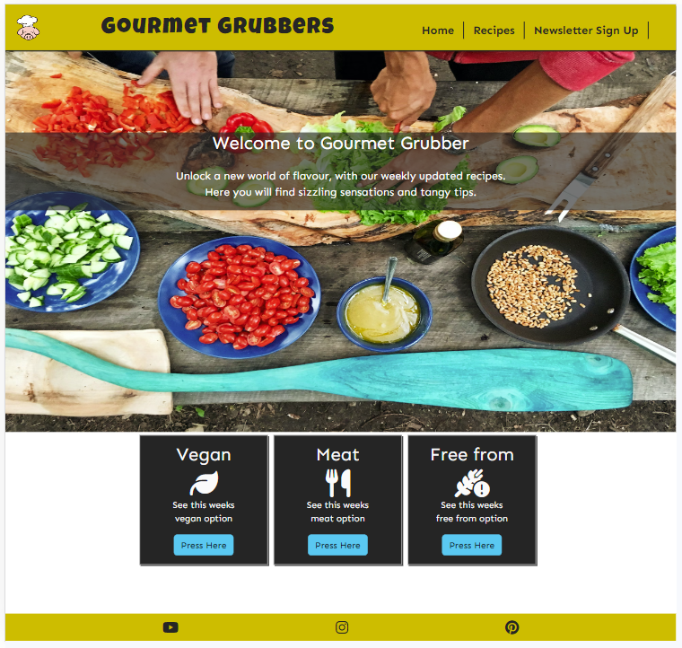

  - As a User I want simple and accessible navigation so I can always move around website easily.
 (Assigned as **Must have** for MVP)

 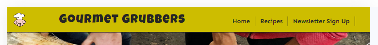
 
  - As a User I want to find gourmet recipes easily so I can make yummy food.
 (Assigned as **Must have** for MVP)

  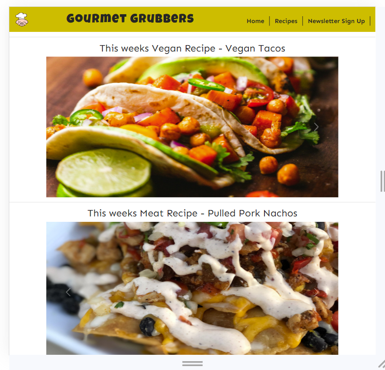

 
  - As a User I want to be notified of new recipes so I can keep trying new food.
 (Assigned as *Should have*)

 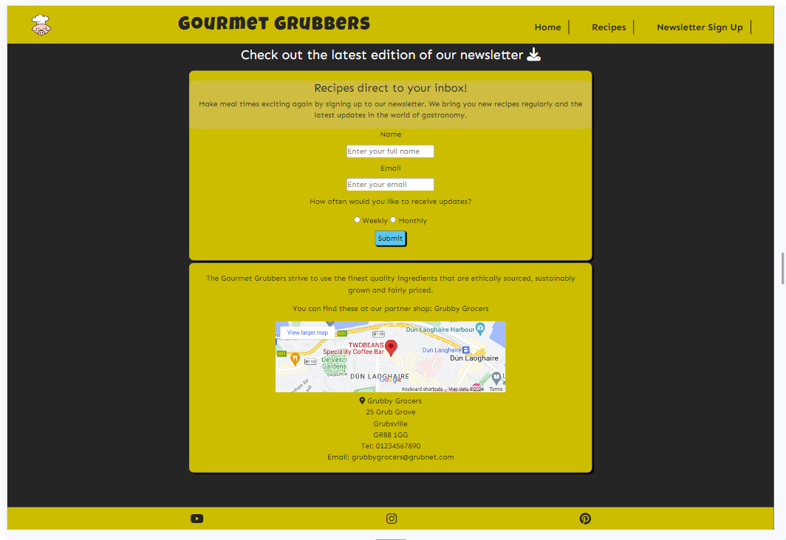

  - As an Owner I want to get more followers signed up to my newsletter so I can build an email list.
 (Assigned as "could have")

  - As a Owner I want to increase social capital by providing access to my social media platforms so I can further my brand. (Assigned as "could have")

  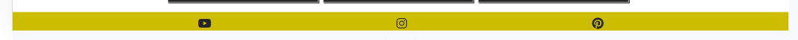
 
  - As a User I want to find new variations on everyday foods so I can easily keep meal times interesting. (Assigned as *Should have*)

 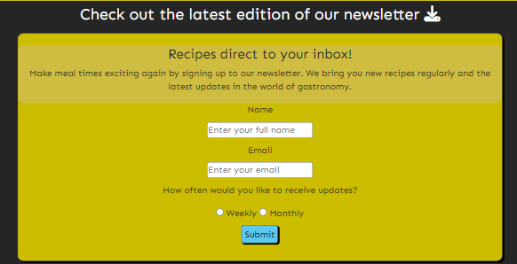

  - As a User I want to know where to find quality ingredients so I can easily follow the recipes. (Assigned as 'Won't have')

### Owner User Stories**

- As an Owner I want my recipes presented in a novel way so I can make my website stand out.
(Assigned as **Must have** for MVP)

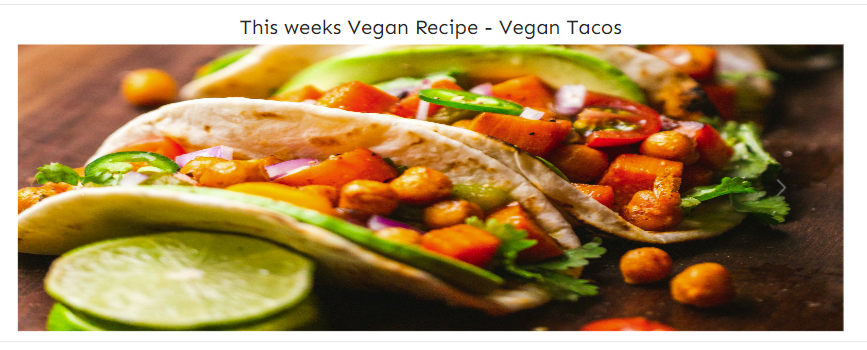

 - As a Owner I want a responsive website so my website can be used on all devices.
 (Assigned as **Must have** for MVP)

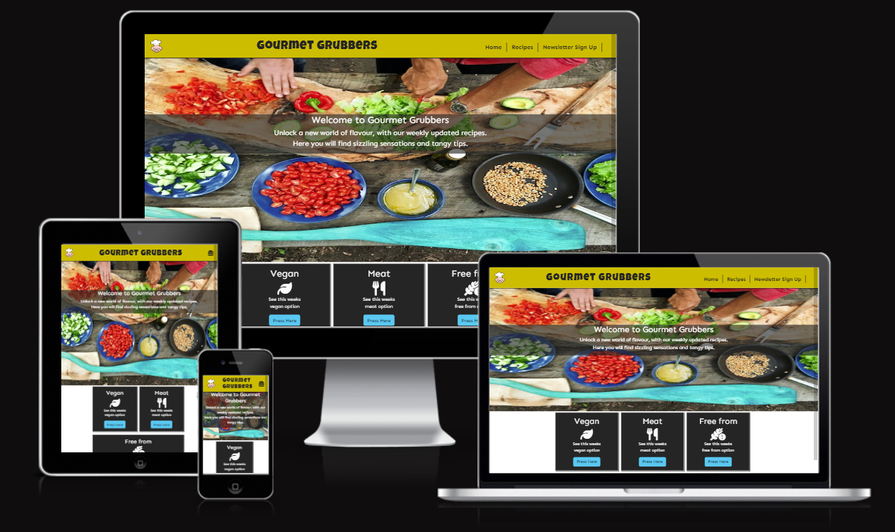

- As an Owner I want appeal to people with diverse dietary preferences so I can increase my audience.
(Assigned as *should have*)

Site clearly aimed at Vegan, Carnivore and people with dietary exceptions.

## Testing

HTML and CSS validations tested on W3C. https://validator.w3.org/

Browser tests performed using Browserling  https://www.browserling.com/

## Deployment

Link to Github Pages url-  https://andy-james-osborne.github.io/Gourmet-Grubbers/index.html

When originally deployed Jumbotron did not work on Edge or Safari. To fix this image was changed to a JPEG and now this works across all browsers.

## Citations

Home Page background image from https://unsplash.com/@mvdheuvel

Taco image from https://unsplash.com/@shanriley via Unsplash.

Taco recipe from https://www.freshoffthegrid.com/camping-recipe-vegan-tacos/.

Pulled Pork nacho images from https://unsplash.com/@natashabhogal at Unsplash.

Nacho recipe from  https://realfood.tesco.com/recipes/bbq-pork-nachos.html

Pizza images from https://unsplash.com/@briewilly at Unsplash.

Gluten free recipe from BBC recipe page. https://www.bbcgoodfood.com/recipes/gluten-free-pizza

Google images location link was taken from LMS lesson on iframes.

## Future Features

* To archive the weekly recipes and make them always accessible. 
* Increase recipe numbers. 

## Bugs and Fixes

Some underlying conflicts in layout between custom CSS and Bootstrap may pose difficulties with future design changes.

- Navbar and title need to be realigned.

- Recipe images slightly squashed down on mobiles esp Galaxy-fold sizes ie 285px widths.

- Jumbotron images too stretched on large desktop sizes ie 2000px +.